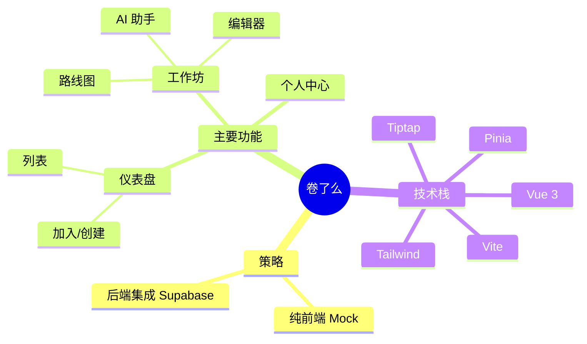

# 卷了么 (JuanLeMe) - 项目思维导图
> 最后更新: 2025-12-24
> 🟢 = 已完成 / ✅ = 进行中 / ⚪️ = 待开发

- **卷了么 (JuanLeMe)**
  - **核心目标**: 让小白通过 Vibe Coding (Copy-Paste) 快速上手全栈开发
  - **用户群体**: 想要学习编程的设计师、产品经理、运营人员

  - **1. 基础设施 (Infrastructure) 🟢**
    - [x] 项目初始化 (Vue3 + Vite + TS)
    - [x] 样式系统 (TailwindCSS)
    - [x] 路由管理 (Vue Router)
    - [x] 状态管理 (Pinia)
    - [x] 代码规范 (ESLint + Prettier)
    - [x] 基础组件库 (Button, Input, NavBar)

  - **2. 核心功能 (Core Features) ✅**
    - **认证模块 (Auth) 🟢**
      - [x] 登录页 (Login Page) - 全屏沉浸式布局
      - [x] 注册流程 (Mock)
    - **工作坊大厅 (Dashboard) 🟢**
      - [x] 我参与的工作坊列表
      - [x] 我管理的工作坊列表
      - [x] 响应式卡片布局 (Auto-fit Grid)
      - [ ] 加入工作坊 (弹窗)
      - [ ] 创建工作坊 (表单)
    - **作战指挥室 (Workshop Detail) 🟢**
      - [x] 路线图侧边栏 (Roadmap Sidebar)
      - [x] 任务详情展示 (Task Detail)
      - [ ] 作业提交功能 (Mock)
      - [ ] 实时聊天室 (Chat)

  - **3. 进阶功能 (Advanced) ⚪️**
    - 个人中心 (Profile)
    - 积分系统 (Gamification)
    - AI 辅助 (Copilot Integration)

  - **4. 部署与运维 (DevOps) ⚪️**
    - Vercel 部署
    - Supabase 集成 (Real Backend)

---

*注：本文档旨在提供清晰的文本结构视图。如需可视化图表，可参考下方的 Mermaid 代码。*

